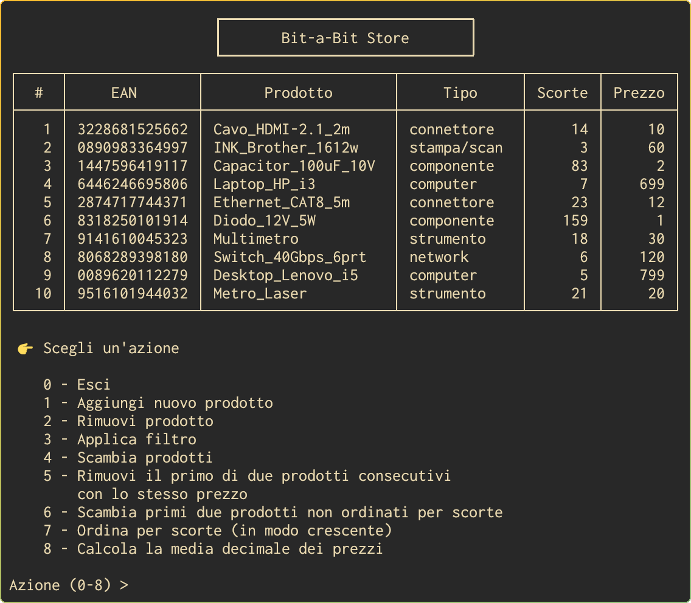

<h1 align="center">Bit-a-Bit Store</h1>

Progetto sviluppato dal Gruppo 14 per il corso di _Architettura degli Elaboratori_, che si tiene durante il secondo semestre del primo anno del CdS in Informatica presso l'[UNICAL](https://www.unical.it) (A.A. 2022/23).

<p align="center">
    </img>
</p>

Il programma è scritto in (GNU) ARM Assembly, ma fa uso di alcune funzioni della Libreria Standard di C. Ciò per evitare di ricorrere alle syscall di Linux.

## Il programma

Per eseguire il programma in GNU/Linux x86_64 è necessario avere `aarch64-linux-gnu-gcc` (sia per Arch che per Debian) e `qemu-user-binfmt` (per Debian) o `qemu-user` (per Arch), e quindi eseguire:

```bash
aarch64-linux-gnu-gcc -static bit-a-bit_store.s -o bit-a-bit_store && qemu-aarch64 bit-a-bit_store
```

All'avvio il programma mostra una tabella e la possibilità di eseguire un'azione. Le righe della tabella costituiscono i prodotti del negozio di elettronica, ciscuno descritto da diversi campi.

I dati sono salvati e letti da un file `entries.dat`. Le azioni che è possibile eseguire sui dati sono:

- aggiungere un nuovo prodotto, inserendo ciascun campo da terminale
- rimuovere un prodotto dopo averne specificando la posizione
- filtrare i prodotti
    - per _prezzo_ (fino ad un certo prezzo o a partire da un certo prezzo)
    - per _tipo_
- scambiare due prodotti dopo avere specificato le loro posizioni
- rimuovere il primo prodotto con il _prezzo_ uguale a quello immediatamente seguente
- scambiare i primi due prodotti non ordinati in modo crescente per il campo _scorte_
- ordinare tutta la tabella per _scorte_ in modo crescente
- calcolare la media decimale dei prezzi dei prodotti

## asm

In modo da evitare di scrivere lunghi comandi per fare operazioni come eseguire, disassemblare o debuggare un file sorgente assembly, ho scritto un semplice script bash che rende tutto più veloce.

Per una sintesti dei comandi eseguire `asm help`.

## Gruppo

- [Alfredo Carlino](https://github.com/CarlinoAlfredo)
- [Giorgio Carlino](https://github.com/carlinogiorgio)
- Mario D'Andrea
