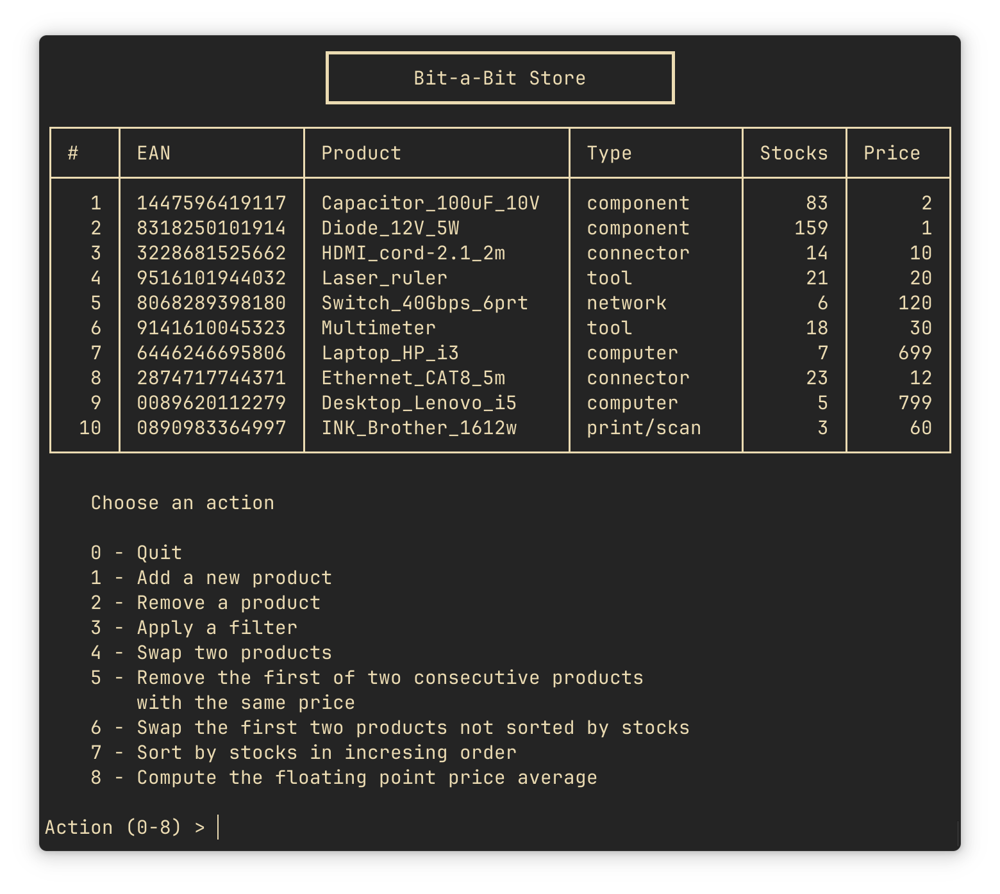

# Bit-a-Bit Store

Group 14's project submission for the Computer Architecture course at [Unical](https://www.unical.it) (A.A. 2022/23).

The app is written in ARM assembly, but calls some functions from `libc`.



## Compile and run the app

On GNU/Linux x86_64 you need `aarch64-linux-gnu-gcc` (for Arch and Debian) e `qemu-user-binfmt` (for Debian) o `qemu-user` (for Arch), then run:

```bash
aarch64-linux-gnu-gcc -static bit-a-bit_store.s -o bit-a-bit_store
qemu-aarch64 bit-a-bit_store
```

## The app

At startup the user is presented a table and an action prompt. The rows of the table represent products of a tech store, each one described by some fields.

The data are stored in a file `entries.dat`. The action that can be executed on the data are:

- add a new product, typing each field from the terminal
- remove a product based on its position
- filter the products
    - by price (between to price extremes)
    - by type
- swap two products based on their position
- remove the first product with the same price as the one following it
- swap the first two products not sorted in increasing order for the _stocks_ field
- sort the whole table by _stocks_ in increasing order
- compute the floating point average of the products prices.
